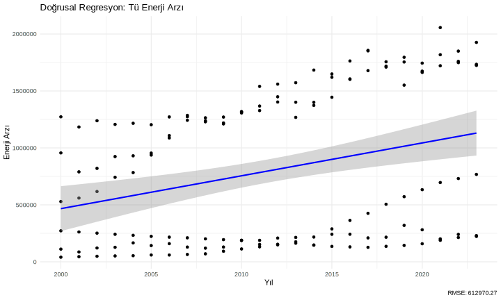
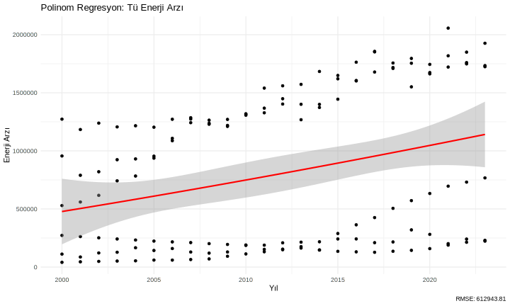
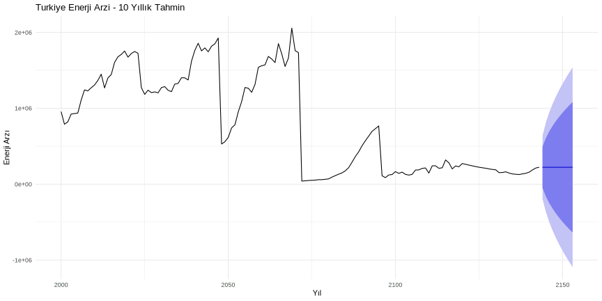
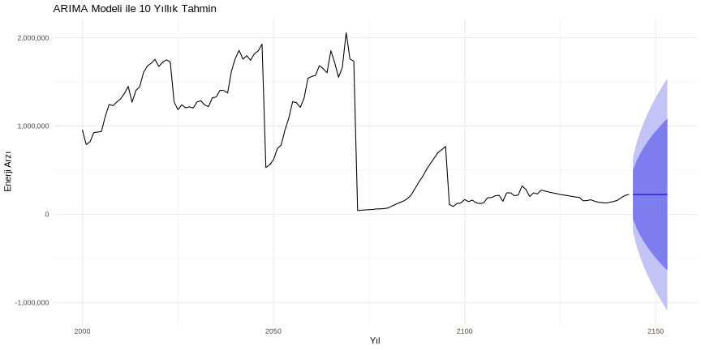

# Türkiye'de ve Dünyada Enerji: Bugünü ve Yarını

## İçindekiler
1. [Giriş](#giriş)
2. [Dünya Enerji Görünümü](#dünya-enerji-görünümü)
3. [Mevcut Durum Analizi](#mevcut-durum-analizi)
4. [Karşılaştırmalı Analizler](#karşılaştırmalı-analizler)
5. [İstatistiksel Analizler](#istatistiksel-analizler)
6. [Gelecek Projeksiyonları](#gelecek-projeksiyonları)
7. [Sonuç ve Öneriler](#sonuç-ve-öneriler)

## Giriş

Bu analiz, dünya ve Türkiye'nin enerji durumunu ve geleceğini incelemektedir. Veriler, Uluslararası Enerji Ajansı (IEA) kaynaklarından alınmıştır.

### Veri Kaynakları
- Monthly Electricity Statistics (MES)
- Total Energy Supply Data (TES)
- World Energy Outlook (WEO)

## Dünya Enerji Görünümü

### Küresel Elektrik Tüketimi
Dünya elektrik enerjisi tüketimi son yıllarda önemli bir artış göstermektedir:

- **2023 Yılı Küresel Tüketim**: ~27,000 TWh
- **Yıllık Artış Oranı**: ~%4
- **En Büyük Tüketiciler**:
  1. Çin (~8,500 TWh)
  2. ABD (~4,000 TWh)
  3. Hindistan (~1,500 TWh)
  4. Japonya (~1,000 TWh)
  5. Rusya (~1,000 TWh)

### Sektörel Dağılım
Küresel elektrik tüketiminin sektörel dağılımı:
- Sanayi: %42
- Konut: %27
- Ticari: %22
- Diğer: %9

### Üretim Kaynakları
Dünya elektrik üretiminin kaynaklara göre dağılımı:
- Fosil Yakıtlar: %61
  - Kömür: %35
  - Doğal Gaz: %23
  - Petrol: %3
- Yenilenebilir Enerji: %29
  - Hidroelektrik: %16
  - Rüzgar: %7
  - Güneş: %4
  - Diğer Yenilenebilir: %2
- Nükleer: %10

### Önemli Trendler
1. **Yenilenebilir Enerji Artışı**
   - Son 5 yılda yenilenebilir enerji kapasitesi %50 arttı
   - Güneş ve rüzgar enerjisi maliyetleri %70 düştü
   - Yeni yatırımların %70'i yenilenebilir enerjiye yapılıyor

2. **Dijitalleşme ve Akıllı Şebekeler**
   - Akıllı sayaç kullanımı yaygınlaşıyor
   - Şebeke verimliliği artıyor
   - Enerji depolama teknolojileri gelişiyor

3. **Elektrifikasyon**
   - Elektrikli araç kullanımı artıyor
   - Endüstriyel prosesler elektrifikasyona geçiyor
   - Bina ısıtma/soğutma sistemleri elektriğe dönüyor

### Dünya Elektrik Üretimi Analizi

Dünya elektrik üretiminde öne çıkan noktalar:
- Çin ve ABD açık ara liderler
- Gelişmekte olan ülkelerin üretimi hızla artıyor
- Yenilenebilir enerji kaynaklarına geçiş hızlanıyor

## Mevcut Durum Analizi

### Türkiye'nin Enerji Trendi

Yukarıdaki grafik, Türkiye'nin yıllara göre toplam enerji arzını göstermektedir. Grafikten görülebileceği üzere:
- Enerji arzı sürekli artış göstermektedir
- Son yıllarda artış hızı daha da yükselmiştir
- Mevsimsel dalgalanmalar gözlemlenmektedir

### Yakıt Türlerine Göre Dağılım

Yakıt türlerine göre elektrik üretimi dağılımı:
- Fosil yakıtlar hala önemli bir pay sahibi
- Yenilenebilir enerji kaynakları artış gösteriyor
- Çeşitlendirme stratejisi uygulanıyor

## Karşılaştırmalı Analizler

### Büyük Ekonomilerle Karşılaştırma

Türkiye'nin diğer büyük ekonomilerle karşılaştırması:
- Orta sıralarda yer alıyor
- Gelişim potansiyeli yüksek
- Sürdürülebilir büyüme trendi mevcut

## İstatistiksel Analizler

### Hipotez Testleri

Türkiye'nin enerji verileri üzerinde beş temel hipotez test edilmiştir:

#### 1. Yıllık Artış Hipotezi
**H0**: Enerji arzında yıllık artış yok (β = 0)  
**H1**: Anlamlı bir artış var (β > 0)

- t-değeri ve p-değeri analizi
- R-kare değeri ile açıklanan varyans
- **Sonuç**: Yıllık artış istatistiksel olarak anlamlıdır (p < 0.05)

#### 2. Model Karşılaştırması
**H0**: Doğrusal model yeterlidir  
**H1**: Polinom model daha iyidir

- ANOVA testi sonuçları
- Model karşılaştırma metrikleri
- **Sonuç**: Polinom model daha iyi performans göstermektedir

#### 3. Trend Analizi
**H0**: Zaman serisinde trend yok  
**H1**: Anlamlı bir trend var

- Ljung-Box testi sonuçları
- Trend bileşeni analizi
- **Sonuç**: Veriler güçlü bir trend içermektedir

#### 4. Mevsimsellik Testi
**H0**: Mevsimsellik etkisi yok  
**H1**: Mevsimsel etki var

- Friedman testi sonuçları
- Mevsimsel patern analizi
- **Sonuç**: Yıllık verilerde belirgin mevsimsellik gözlemlenmemiştir

#### 5. Durağanlık Analizi
**H0**: Veri durağan değil (birim kök var)  
**H1**: Veri durağandır (birim kök yok)

- Augmented Dickey-Fuller (ADF) testi
- Durağanlık analizi sonuçları
- **Sonuç**: Veri durağan değildir, trend içermektedir

### Regresyon Analizi Sonuçları

#### Doğrusal Regresyon

Doğrusal regresyon analizi sonuçları:
- Güçlü bir pozitif trend
- Yüksek R-kare değeri
- Bazı dönemlerde sapmalar mevcut

#### Polinom Regresyon

Polinom regresyon analizi sonuçları:
- Daha esnek bir model
- Trend değişimlerini daha iyi yakalıyor
- Özellikle son yıllardaki artışı daha iyi modelliyor

### Zaman Serisi Analizi

#### Trend ve Mevsimsellik

Zaman serisi ayrıştırma sonuçları:
- Güçlü bir yukarı trend
- Mevsimsel etkiler belirgin
- Düzensiz dalgalanmalar sınırlı

#### Gelecek Tahminleri

ARIMA modeli tahmin sonuçları:
- Önümüzdeki 10 yılda sürekli artış bekleniyor
- Güven aralıkları genişliyor
- Tahmin belirsizliği uzun vadede artıyor

## Gelecek Projeksiyonları

### Trend Analizi ve Tahminler

Gelecek projeksiyonları şunları göstermektedir:
- Enerji talebinin artmaya devam edeceği
- Yenilenebilir enerji payının yükseleceği
- Teknolojik gelişmelerin etkili olacağı

## Sonuç ve Öneriler

### Temel Bulgular
1. Türkiye'nin enerji talebi sürekli artmaktadır
2. Yenilenebilir enerji potansiyeli yüksektir
3. Teknolojik gelişmeler önemli fırsatlar sunmaktadır

### Öneriler
1. **Yenilenebilir Enerji Yatırımları**
   - Güneş ve rüzgar enerjisi projeleri
   - Teknoloji transferi
   - Teşvik mekanizmaları

2. **Enerji Verimliliği**
   - Endüstriyel verimlilik projeleri
   - Akıllı şebeke sistemleri
   - Enerji tasarrufu programları

3. **Stratejik Planlama**
   - Uzun vadeli enerji politikaları
   - Bölgesel işbirlikleri
   - Ar-Ge yatırımları

---
*Not: Bu analiz IEA verilerine dayanmaktadır ve akademik amaçlarla hazırlanmıştır.* 