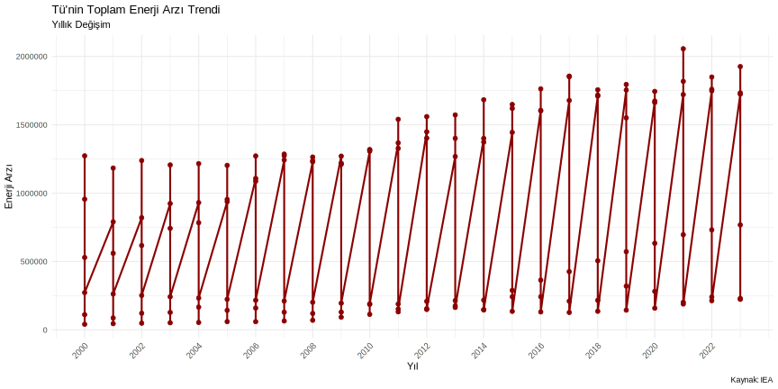
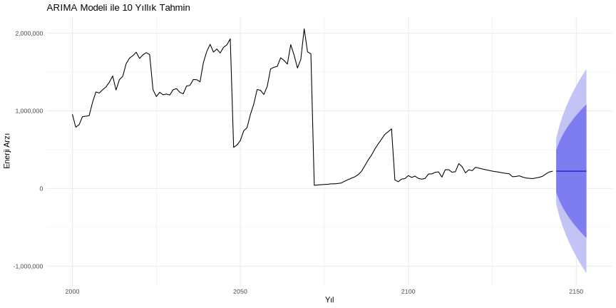
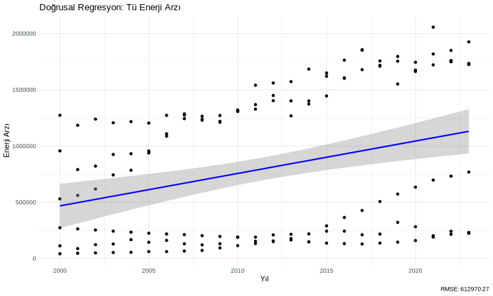

```{r setup, include=FALSE}
knitr::opts_chunk$set(echo = FALSE, warning = FALSE, message = FALSE,
                     fig.width = 10, fig.height = 6, dpi = 300)

# Kutuphaneler
library(tidyverse)
library(readxl)
library(forecast)
library(ggplot2)
library(scales)
library(caret)
library(MASS)
library(mgcv)
```

# Giris

## Proje Amaci
- Enerji verilerinin analizi
- Uluslararasi karsilastirmalar
- Gelecek tahminleri

# Analizler

## Karsilastirmali Analiz
```{r karsilastirma}
knitr::include_graphics("grafikler/1_uretim_karsilastirma.svg")
```

## Trend Analizi
```{r trend}

```

## Dagilim Analizi
```{r yakit}
knitr::include_graphics("grafikler/3_yakit_dagilimi.svg")
```

# Zaman Serisi

## Trend Analizi
```{r zaman_trend}
knitr::include_graphics("grafikler/ts_1_trend_analizi.svg")
```

## Tahminler
```{r forecast}

```

# Regresyon

## Model Sonuclari
```{r reg_models1}

```

## Ileri Modeller
```{r reg_models2}

```

# Sonuc

## Oneriler
1. Yenilenebilir enerji
2. Verimlilik artisi
3. Teknoloji yatirimi 